## 

## 📈 Github Stat

## Environment
- **OS:** Windows 11 & Linux (Zorin OS)
- **Editor:** VS Code & Antigravity
- **Language:** Python, HTML, CSS, JS, Odin, Java, C#, Lua

## Hi!
HI! I'm MintaOffcial(MintaOfficial) I'm interested in things related to Linux, Windows, Cybersecurity, Blender
- I Like To Ethical Hacking.
- I Like Vide Coding.

## Hobbies
- **Minecraft:** Play And Moding
- **Vs Code:** Building Website And Update

